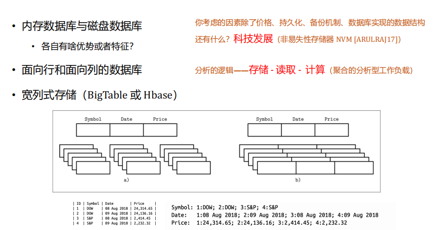

## 引入 Introduction

有如下设计的表完成以下业务处理：从数据库中取出一条`FLAG`值为`N`的数据，经过应用处理后，将`FLAG`值修改为`Y`插入数据库。

| id   | name | FLAG |
| ---- | ---- | ---- |
|      |      | Y/N  |

**问题**：数据库中存在大量`FLAG`值为`Y`的数据，查询效率低。

**尝试解决**：换用$bitmap$索引

|       | **1** | **2** | **3** | **4** | **5** |
| ----- | ----- | ----- | ----- | ----- | ----- |
| **Y** | 1     | 0     | 1     | 1     | 0     |
| **N** | 0     | 1     | 0     | 0     | 1     |

**更大的问题**：锁机制导致修改时该数据块无法读取。位图索引使数据很容易被压缩，而数据库按块（页）组织数据。

> $bitmap$(位图索引)不适合**频繁修改**值域有限的字段

**最终解决**：使用函数索引

## 内容大纲 Outline

- 需要理解数据库体系结构
- 需要理解锁和并发控制特性
  - 每个数据库都以不同的方式实现
- 不要把数据库当“黑盒”
- 性能、安全性都是适当的被设计出来的
  - 12306系统数据库设计直接影响性能
- 用尽可能简单的方法解决问题
  - “创造”永远追不上开发的步伐
  - 数据库99%的问题都已经被前人解决了
- DBA和RD之间的关系
  - DBA负责数据库的备份与恢复，程序员对其他职责负责
- SQL开发和程序设计的差别
- 数据库表结构设计
- 数据库架构
- 存储：内存数据库和磁盘数据库

## 数据库体系结构

 **不能把数据库当成“黑盒”使用，因为每个数据库都是非常不同的**

> Oracle和MySQL的差别，类似：
>
> - Windows和Linux的差别
>
> -  iOS和Android的差别
>
> - 虽然都是DBMS，但它们也有相当的差异

## 并发控制与锁机制

- 这个时候，Transaction1能提交吗？

  

Oracle的多版本控制，读一致性的并发模型

- 读一致查询：对于一个时间点（point time），查询会产生一致的结果
- 非阻塞查询：查询不会被写入器阻塞，*但在其它数据库中可能不是这样的*

最简单的验证方式：


对于左侧，打开游标时，**不会读取数据，只有在读取游标时才会读取数据**

对于右侧，如果我们删除了所有的表，但是我们在Oracle中仍然可以使用之前打开的游标来读取那个时刻的数据

事实上，打开游标的时候确实没有复制，删除数据的时候也确实删除了，**但是删除数据的时候Oracle为我们使用Undo日志来保存了**下来(我们记作Undo statement)，是删除的回滚段，游标从这类读出数据。

> Oracle认为“读”不那么重要，“读”锁不应该存在。这么实现的好处：有效提高了吞吐量。
>
> Oracle锁机制的相关结论：
>
> 1. 只有修改才加行级锁
>
> 2. Read绝对不会对数据加锁
>
> 3. Writer不会阻塞Reader
>
> 4. 读写器绝对不会阻塞写入器

**例子**：`ACCOUNTS(account_number, account_balance)`一个银行的账户余额，为了简单，只考虑一个仅有四行的表

我们想运行一个日报表，了解银行里有多少钱。下面是一个非常简单的查询：

```sql
select sum(account_balance) from accounts;
```


## 打开黑盒

Q：深入了解每个数据库的锁机制实现细节，对码农编码有什么影响嘛？

Oracle的无阻塞设计有一个副作用，就是如果确实想保证一次最多只有一个用户访问一行数据，就得**开发人员自己做一些工作**

**例1**：一个资源调度程序（e.g. 空闲教室查询）主要有两张表:

1. `Resources(Resource_name,other_ data)`
2. `Schedules(resource_ name, start_time, end_time)`

往Schedules中插入一个房间预订之后，提交之前，应用将查询

```sql
Select count(*)
   From schedules
      Where resource_ name =:resource name FOR UPDATE
         and (start_time < :new_end_time) and (end_time > :new_start_time)
```

如果没有`FOR UPDATE`语句，将可能同时读出两条冲突数据：
$$
\begin{split}
  A：(701, 10:00, 12:00) \\
  B：(701, 11:00, 12:00)
\end{split}
$$

要构建一个完全数据库独立的应用，而且是高度可扩展的应用是极其困难的

**例2**：$Null$值造成的数据库迁移障碍

**任务**：在表T中，如果不满足某个条件，则找出X为$NULL$的所有行，如果满足就找出X等于某个特定值的所有行

> `NULL = NULL` 的返回结果**因数据库而异**，Oracle中`NULL == NULL` 返回 NULL


## 性能与安全—数据库设计

**性能调优**：

1. 根据当前CPU能力、可用内存、I/O子系统等资源情况来设置相应参数：DBA在做，性能提高20-30%
2. 通过**索引、物理结构、SQL**的优化，**具体提高某一个查询的性能**

*如果有个专家能通过一些参数、技巧提高了你的系统一个数量级的性能，不能说这个专家牛逼，大概只能说明你的程序太烂了。*

### 性能拙劣的罪魁祸首是错误的设计

- 提高整体性能
  - 技巧决定系统性能的下限
  - 设计决定系统性能的上限

> 比如，新浪新闻的门户网站
>
> - 动态页面vs静态页面
> - **静态页面+内容管理系统**，效率更高、更复杂

衡量性能的指标：任何事务在1s内完成**（×）**

性能指标：T/s, 1秒中能处理多少事务

原因：**阻塞蔓延**，并发量增加时处理速度显著下降

### 使用优化工具


定位拥堵点、反向定位程序点

### 整体层面性能优化考虑

**问题一：cpu负载高，io负载低**

- 内存不够

- 磁盘性能差（磁盘问题、raid设计不好、raid降级）

- **SQL的问题**

- **并发锁机制的问题**

- **事务设计问题，大量小数据IO**

- **大量的全表扫描**

**问题二：IO负载高，CPU负载低**

- **大量小的IO执行写操作**

- **Autocommit，产生大量小IO**

- **大量大的IO执行写操作**

- **SQL的问题**

- IO/PS磁盘限定一个每秒最大IO次数

**问题三：IO和CPU负载都高**

- 硬件不够用了

- **SQL存在问题**

*性能问题，90%的问题来源都是程序员的问题*

*开发环境到生产环境是一场灾难*

### SQL优化的方向


## SQL开发和程序设计的差异

### 限用Boolean类型

- SQL中并不存在`Boolean`类型

- 实现flag表示标志位的Y/N或T/F
  - 例如：order_completed  *修改为完成时间更合适*
  - 但是…往往增加信息字段能包含更多的信息量

  - 例如：completion_date completion_by

  - 或者增加order更多状态标示

- 极端的例子：四个属性取值都是T/F，可以用0-15这16个数值代表四个属性所有组合状态
  - 技巧可能**违反了原子性的原则** *设置四个字段更好*
  - 为数据而数据，是通向灾难之路

> 思考：从学号中可以获得入学年份、院系信息，为什么还要添加院系信息的字段，是否不符合3NF？
>
> Answer：学号拆开违反了1NF，每个字段当成**一个值**来用，字段要具有现实含义，数据表设计要简单。

**补充：**

```sql
select ... f(x) 
from table1, table2
where g(x)
```

数据库执行的性能瓶颈在**笛卡尔积**和**Where Condition**

`f(x)`只执行一个，`g(x)`在每行数据都要执行一次。所以尽可能使用数据库自带的函数，尽可能让字段简单（用`g(x)`代价很大）

**和编程的差异在，SQL绝大多数时候，不需要“特别的思考和技巧“**

### 过于灵活的危险性

- “真理向前跨一步就是谬误”

- 不可思议的四**通用**表设计(面向对象)
  - `Objects(oid,	name),	Attributes(attrid,	attrname,type)`
  - `Object_Attributes(oid,attrid,value)`
  - `Link(oid1,oid2)`
  - 随意增加属性，避免`NULL`

- **成本急剧上升，性能令人失望**

### 约束应明确说明

> 数据之间有隐含的业务约束：如100人以上的系算”大系“。
>
> 数据库被多个应用程序使用，这些数据更适合放在数据库表中。

- 数据中存在隐含约束是一种不良设计

- 字段的性质随着环境变化而变化时设计的错误和不稳定性

- 数据语义属于DBMS，别放到应用程序中

约束放在应用程序（配置文件）还是数据库（表结构）里取决于企业价值观

## 数据库表设计

### 理解子类型（SubType）

场景：运动员(公共属性年龄、体重)<- 不同类型的运动员(比赛成绩、身体属性)，如果一个运动员可以报多个项目，要查询运动员所有信息

- 表过“宽”（有太多属性）的另一个原因，是对数据项之间的关系了解不够深入

- 一般情况下，给子类型表指定完全独立于父表主键的主键，是极其错误的

> 几种设计：满足3NF的设计、限制运动员报的项目（允许一定的空值）、删除主表（带来的更新年龄信息的困难，若使用触发器带来更严重的bug）
>
> ~~挂雍正画像有助于消除bug (四阿哥消除八阿哥)~~

### 如何处理历史数据

- 历史数据：例如：商品在某一时刻的价格 *双十一修改价格数据*

- Price_history
  
- `(article_id ,	effective_from_date ,	price)` 
  
- 缺点在于查询当前价格比较笨拙

  > 对`Date`类型的查询较麻烦，不能查`='2024-11-11'`,会查出`'2024-11-11 00:00:00:00'`的结果‘
  >
  > 如果只有起始时间，查询当前价格要比较**所有记录**

- 其他方案
  - 定义终止时间    *起始时间，终止时间，可能造成读出Default价格*
  - 同时保持价格生效和失效日期，或生效日期和有效天数等等
  - **当前价格表+历史价格表**    *需要更新两张表，商业上问题较小*

## 数据库架构

### 处理流程

- 操作模式（operating mode）
  - 异步模式处理（批处理）   *系统安全性最大的障碍*
  - 同步模式处理（实时交易）   *大量校验*

- 处理数据的方式会影响我们物理结构的设计

### 数据集中化（Centralizing）

**集中式的问题**：单点性能增长的边际效应——成本大幅增加

- 分布式数据系统复杂性大大增加， 吞吐量增加
  - 远程数据的透明引用访问代价很高
  - 不同数据源数据结合极为困难
    - Copy的数据传输开销
    - 无法从数据规划中获益（物理结构，索引）

- 数据库该如何部署呢？
  - **中庸**、分析、决策

- 离数据越近，访问速度越快

### 系统复杂性

随着大模型的应用，限制瓶颈从网络访问转移到计算资源（未来几年，对计算资源的优化是对程序员的一个要求）

- 数据库的错误很多
  - 硬件故障
  - 错误操作…

- 数据恢复往往是RD和DBA争论焦点
  - DBA，即便确保数据库本身工作正常，依然无法了解数据是否正确
  - RD，在数据库恢复后进行所有的功能性的检查

## 存储问题

- 内存访问比磁盘访问快几个数量级
- 内存的持久化问题，什么时候写

> 我们应该关注硬件的发展，若非易失存储器发展，Memory Database将迅速发展



- 用“行存储”的理论基础：空间局部性原则

- 面向”列“存储：计算聚合性的分析性工具负载（趋势、平均值等），在压缩效率上有明显的提升

---

**总结：**

数据库的众多问题通用答案——**不清楚，看情况**