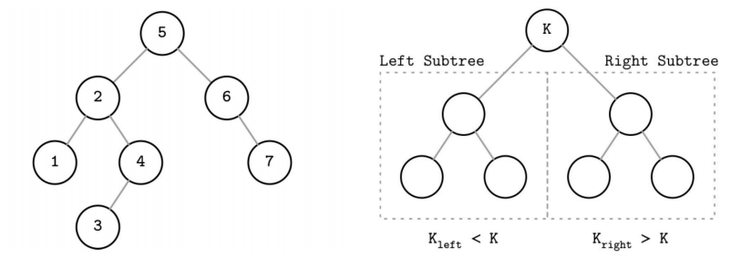
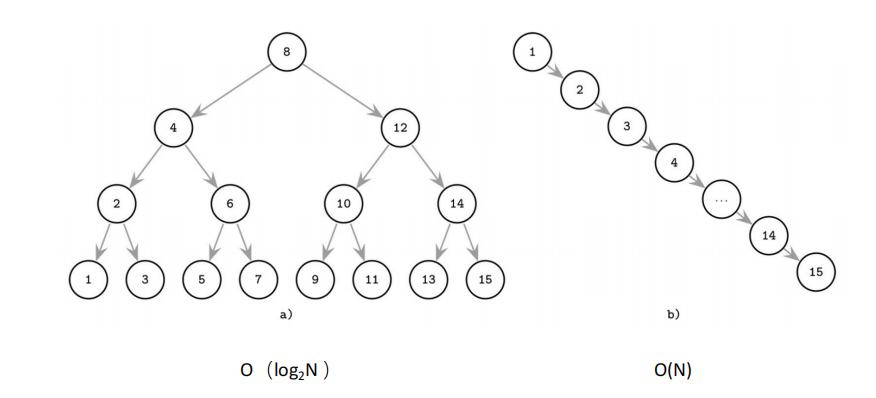
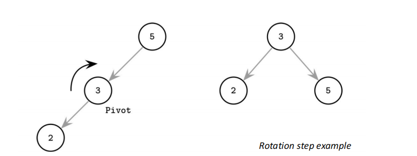
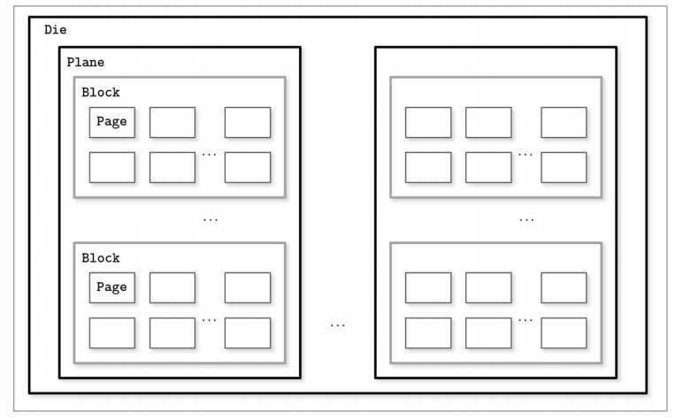
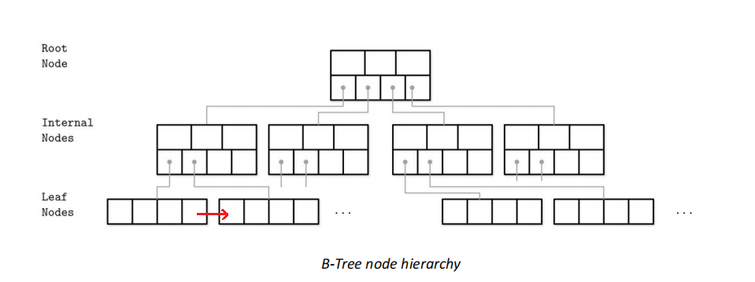
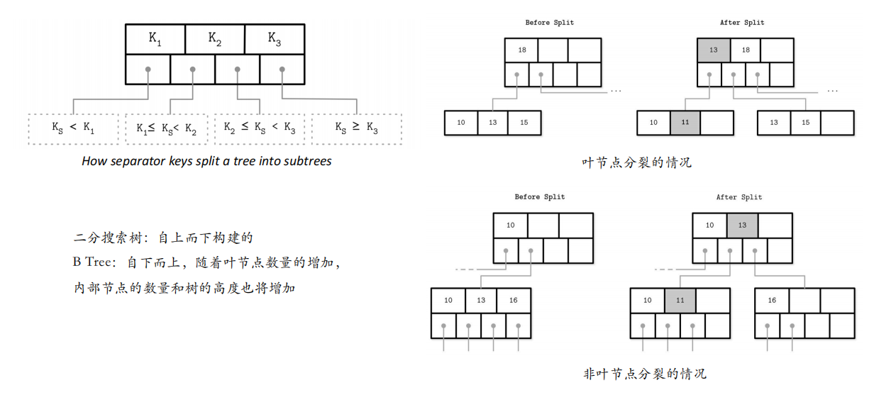
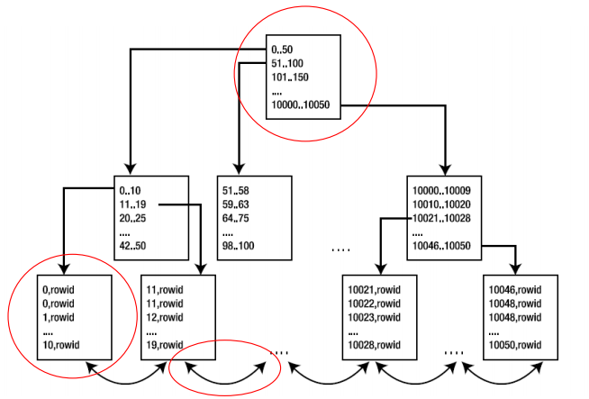
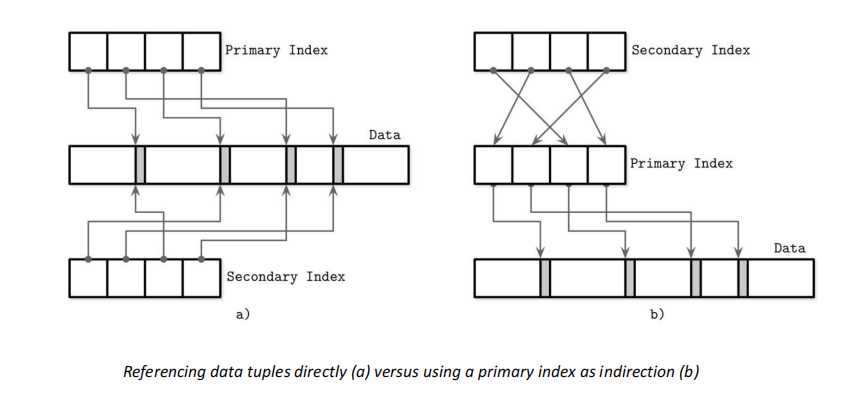
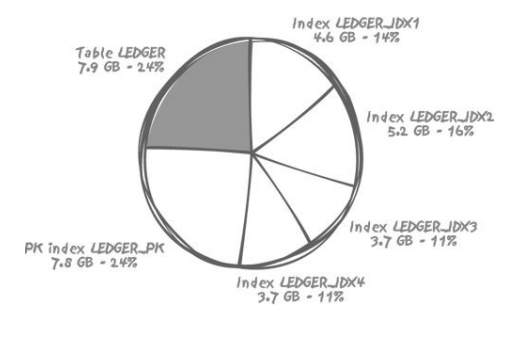

## 内容大纲

- 什么是索引
- B+树的组织形式
- B+树的查找、插入、删除
- B+树索引的用途
- 多个索引的情况
- 索引的代价
- 如何让索引发挥作用

## 什么是索引

数据库管理系统（DBMS）中一个排序的数据结构，以协助快速查询、更新数据表中的数据。

> 快速主要针对**读**
>
> 思考：应该用什么数据结构？

## 索引的数据结构—B+树

### 二分搜索树(BST)

我们从二分搜索树(BST)思考数据库索引应该使用的数据结构



当树的一侧“过长”，查找的时间复杂度会退化成$O(n)$，需要通过`旋转操作`使树达到平衡



旋转操作：



### 基于磁盘存储的树-磁盘

平台级软件，和硬件的关系非常⼤（操作系统、数据库、嵌⼊式、芯片……）

> **磁盘**的最小单元：page、**block**
>

图示：



在磁盘修改数据的两种方式：

- 将修改操作处理成删除和插入
- 行迁移操作：添加指针指向放不下的数据 *会导致数据读取效率下降(数据在不同块中)*

*在处理磁盘存储数据的结构需要考虑块读取的问题*

磁盘上的树要考虑磁盘读取效率，树主要考虑以下两个指标：

- 扇出(fanout)：每个节点允许最大的子节点
- 树高(tree height)：树的高度  *多少层的树，就要读取IO多少次*

**高扇出**（改善临近键的数据局限性）为手段实现**低树高**

### 基于磁盘存储的树-B-Tree(B+Tree)

> 在数据库领域，B树指这一类结构的树，其中也包含B+树
>
> B树是一块一块的将数据读取到内存，哪怕访问的是一条，也会把该条所在的块读入到内存，一般是4K一个块。

**B Tree (B+Tree)结构**





- 页组织技术，一个节点就是一个Page*（如4K, 16K）*
- 每个节点最多$N$个键和$N+1$个指向节点的指针
- 占用率：节点容量和实际持有键的数量之间的关系
  - 占用率高利于读，但不利于写

**B树和B+树之间的差异**：B+树中，非叶子节点只做比较，数据存储在叶子节点中。

叶节点的同级节点指针：解决SQL中范围查询`BETWEEN`的效率问题

### B树查找算法

- 查找，从根节点到叶节点的单向遍历

- 从根节点上执行⼆分搜索算法，将要搜索的$K$，与存储在根节点中的$K_n$进行

  比较，直到找到大于$K$的第⼀个分隔键，这样定位了⼀个要搜索的子树，顺

  着相应指针继续相同的搜索过程，直到目标叶节点，找到数据主文件指针

块中键数量的设计：

- 最佳页大小，依赖设备的K

- 保存$k—2k$个键，$k+1—2k+1$个指向子节点的指针

### B树的插入—节点分裂

#### 叶节点分裂

Step1：<u>查找算法定位目标叶节点</u>，并将新值关联

Step2：有空就插入，没空就叫”节点溢出“overflow，必须<u>分裂</u>

- 叶节点：超过$Max(N)$最多容纳N个键值对
- 非叶节点：指针超过$Max(N+1)$

Step3: 分裂——分配新节点，将一半元素从原节点传输给它，并添加它的第一个键(**拷贝一份**到父节点)和指向父节点的指针，这时候，键被提升了。执行分裂的数组下标称为而分裂点

#### 非叶节点分裂

1. 创造新节点

2. 将原节点下标为$N/2+1$的元素，**移动**到新节点

3. 分裂点的键被提升到父一级

4. 插入要插入的节点

5. 生成额外指针，指向新裂变的节点

### B树的删除—节点合并

节点合并的判定条件：（节点最大容纳N个键值对）

- 对于叶节点：两个相邻节点的键值对数量小于或等于N
- 对于非叶节点：两个相邻节点中指针的数量小于或等于N+1

*一般50%是树状结构节点占用率的阈值*

> 思考：删除和插入操作是否会导致B树节点分裂合并的频繁操作？
>
> 解决方案：
>
> 1. 按存储空间对”满“和”空“进行设置，*从更上一层的视角解决*
> 2. 为了减少分裂和合并的次数，DBMS会使用”再平衡“

### B+树索引能干什么



表记录的具体内容仍存储在随机文件中，一般索引中只存`rowid`

> 假设访问硬盘一个块的代价为1次I/O, B+树找到对应key的叶节点消耗3次I/O, B+树叶子节点中连续读取消耗2次I/O，读到70个rowid
>
> - 若70个rowid在一个块中，消耗代价：3 + 2 + 1 = 6 次 I/O
> - 若70个rowid在70个块中，消耗代价：3 + 2 + 70 = 75 次 I/O

索引帮助快速查询表中的记录，充分理解B+树索引的结构，你就能充分B+树能做什么不能做什么

能做的：

- 全键值 `Where x = 123` (`depth + 1`次的固定次数)
- 键值范围 `Where 45 < x < 123` (先进行`x=45`，然后顺序读取直到`x>=123`)
- 键前缀查找 `where x LIKE J%’`

## 多个索引情况

> 在Mysql、Oracle中，默认会为主键添加主键索引

两种方式的优缺点：



方案b对**读**代价高（两次查询），但是数据发生修改时，只需要对`Primary Index` 进行修改

*数据库问题的中“读写矛盾问题”*

## 索引的代价（另一面）

1. 时空矛盾：索引消耗大量磁盘空间，用空间换时间

   

2. 更新索引带来的额外的处理时间开销
3. 数据库系统处理的开销*（trigger触发器）*

那为什么还要索引？一般来说，数据库查询的数量远高于更新。舍弃一定的更新效率提升查询效率是合理的。

**但是，索引还可能降低查询的效率。**

> 补充：复合键索引$index(a, c)$, B+树按第一个$a$作为主索引确定位置，按$c$确定在叶节点中的位置。
>
> 对于B+树索引，不少数据库都有自己的处理方式，比如，MySQL中不同的存储引擎使用了不同的方式把索引保存到磁盘上，他们会影响性能。
>
> 1. MyISAM使用前缀压缩以减少索引，而InnoDB不会压缩索引，(有啥差别? )
> 2. MyISAM索引按照行存储的物理位置引用被索引的行，但是InnDB按照主键值引用行，(有啥差别?)

1. 当表过小（记录数少）的时候，使用索引的查询代价可能更高。

2. 当每条记录很小，一个块中可以容纳很多记录，使用索引的查询代价可能更高。

   *1.2. 关键是对应的块的数量*

3. 大规模范围查询，全表遍历可能更快或更稳定

   > 经验：当SQL语句检索出原表10%的数据，索引的代价高于全表遍历

**索引和目录**

1. 索引和目录是两种完全不同的机制

2. 索引是一种以**原子粒度访问数据库的手段**而不是为了检索大量数据的

   - 原子粒度是直接读取记录，而不是检索大量数据而存在。

   - 索引是访问数据库的手段

## 让索引发挥作用

1. 判断索引适用性的依据是检索比例

2. 什么时候应该使用B树索引

   - 仅需要通过索引访问基本表的很少一部分行

   - 如果要处理表中的多行，可以使用索引而不使用表

### 只使用索引不使用表

如果是$Index(x，y)$， 表的数据如下：
$$
\begin{split}
  (10046, 2345, rowid) \\
  (10048, 245, rowid) \\
  (10048, 290, rowid) \\
  (10048, 1356, rowid) 
\end{split}
$$
那么当执行以下的SQL时，就可以只使用索引不使用表

```sql
Select x, y From T
Where x...
```

> 复合键索引，本质上索引是按照排名第⼀的字段进⾏的索引
>
> 只有索引没有表呢？~~恭喜你可以设计数据库了~~：IOT

### 索引是数据库的重要组成部分

- 索引始终是数据库中极重要的组成部分
  - 通用目的*（增删改查）*或事务处理型数据库系统
  - 决策支持系统

- 事务处理型数据库中 “太多索引≈设计不够稳定”

---

在下一节中，我们将学习哈希索引、位图索引、函数索引等其他类型的索引。