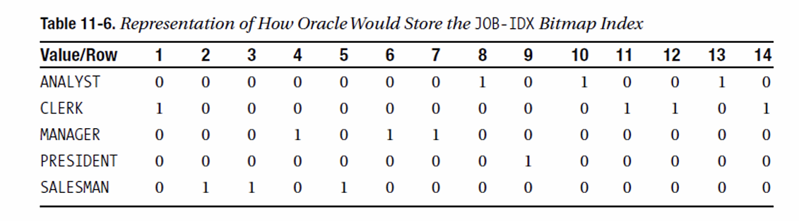
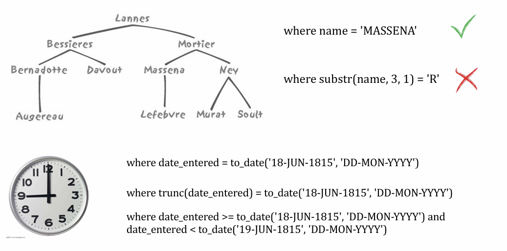
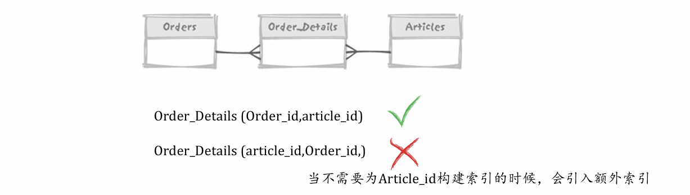

## 哈希索引

哈希索引结构：


- 哈希索引可以做全键值查询，无法做范围查询、前缀查询

- 哈希的效率比B树查询更高 *只需要一次查询*，尤其是对字符串的查询（应用：身份证号）

- 哈希碰撞：需要回到主表进行比较。一般需要开10倍的空间代价来减少碰撞
  - 哈希冲突的处理方法：开散列、闭散列

### 几种哈希函数

1. 直接定址：分布均匀，数据较少
2. 除留余数法
3. 平方取中（$1234^2 = 1522756$, 15<u>227</u>56）：将原先分散的数据变得均匀，适合数据较大的情况

### 自适应哈希索引

在二级-一级数据这样的结构，当出现某二级索引访问频率高的时候，将其变为哈希索引，快速找到地址。

- 好处：效率高

- 坏处：占空间、只能做等值查询操作多

## 位图索引

### 位图索引结构



```sql
Select	count(*)	from	emp	where	job	=’CLERK’	or	job	=	‘MANAGER’
Select	*	from	emp	where	job	=’CLERK’	or	job	=	‘MANAGER’
```

### 位图索引使用场景

- 相异基数（distinct cardinality）低
- ⼤量临时查询的聚合

### 位图连结索引

允许使用另外某个表的列对⼀个给定表建立索引。实际上，这就是允许对⼀个索引结构（而不是表本身）中的数据进行逆规范化。

### 没有位图索引的MySQL

思考：MySQL没有位图索引，当遇到相异基数低的数据时，应该怎么办？—— 构建复合索引

1. 优化替代索引组合
2. 低选择性添加特殊索引

- `Select * from profiles where sex = ‘M’ order by rating limit 10`
  
- 可以添加`sex` ，`rating`列上的复合索引。
  
- `select * from profiles where sex = ‘M’ order by rating limit 100000, 10;`

  -  依旧很慢，更好的策略是限制用户查看的页数

  当查询条件非常多时，可能要考虑拆分SQL，把最不可能出现的条件拎出来。

你的搜索界面设计：

> 1. 增加隐含的排序条件（时间、热度）
> 2. 搜索结果分页：数据库分页查询，提升效率
> 3. 设计“骗人”的搜索结果：*已为你查找到相关的25000条数据* 😀

## 函数索引

函数索引，对$F(x)$的值构建索引，在通过对索引读取x所指向的记录行。函数索引仍然使用B+树。

- $X$索引，和$F(x)$的索引完全不⼀样

### 函数索引的应用

1. 不区分大小写的查询
   - `teachER` -> `TEACHER` 

2. T、F的巨大差异下的索引
   - True比例99%, False比例1%
   - 如是True，返回NULL，根据False的值建立B树索引

```sql
Create index emp_upper_idx on emp(upper (ename)) Select * from emp where upper(name) = ‘KING’ 

Create unique index active_project_must_be_unique on projects(case when status = ‘ACTIVE’ then name end)
```

## 索引使用的典型问题

### 函数和类型转化对索引的影响

`Where f ( indexed_col ) = 'some value'`

这种检索条件会使索引无法发挥作用

- 日期函数 

- 隐式类型转换



### 索引与外键

系统地对表的**外键**加上索引的做法非常普遍

- 减少上锁的时间
- 例外：不常更新的代码表无需构建索引（外键很少修改）

### 同一个字段，多个索引

如果系统为外键自动增加索引，常常会导致同⼀字段属于多个索引的情况



为每个外键建立索引，可能会导致多余索引

> 可能变化、可能利用的字段放在最前面，**构建主键（复合键）索引就不必单独建索引**

有些公司会在`(order_id, article_id)`表中添加流水id，~~但6+老师不喜欢~~😂，如果order_id是字符串的时候能提升效率。

### 系统生成键

系统生产序列号，远好于

- 寻找当前最大值并加1  *锁住整个表，变成了单机系统*
- 用⼀个专用表保存”下⼀个值“且加锁更新  *还可以提供数字池，任取一个数字插入*

但如果插入并发性过高，在主键索引的创建操作上会发生十分严重的资源竞争 *在一个**块**内*

- 即使基本表可以支持并发，但在索引上不支持

**解决方案**

- 反向键索引或叫逆向索引（reverse index）  $1346->6431$
  - 函数索引的另一种使用方式，目的是避免索引中“块”的冲突

- 哈希索引（hash indexing）

## 查询优化器不使用索引

为什么呢？反思自己的问题

- 情况1：我们在使用B+树索引，⽽且谓词中没有使用索引的最前列 
  - $T，T(X,Y)$上有索引，做`SELECT * FROM T WHERE Y=5`

- 情况2：使用`SELECT COUNT(*) FROM T`，⽽且T上有索引，但是优化器仍然全表扫描 
- 情况3：对于⼀个有索引的列作出函数查询 
  - `Select * from t where f(indexed_col) = value `
- 情况4：隐形函数查询
- 情况5：此时如果用了索引，实际反而更慢
- 情况6：没有正确的统计信息，造成CBO无法做出正确的选择

总结：归根到底，不使用索引的通常愿意就是“不能使用索引，使用索引会 返回不正确的结果”，或者“不该使用索引，如果使用了索引就会变得更慢”。

---

本章小结：

- “查询使用了索引就万事大吉了”—误解啊∼∼ 

- 索引只是访问数据的⼀种⽅式

- “通过索引定位记录”只是查询⼯作的⼀部分

- 优化器有更多的选择权利 

*总结：索引不是万灵药。充分理解要处理的数据，做出合理的判断，才能获得高效方案（正确的废话）*

在下一章，将学习数据表的物理实现。