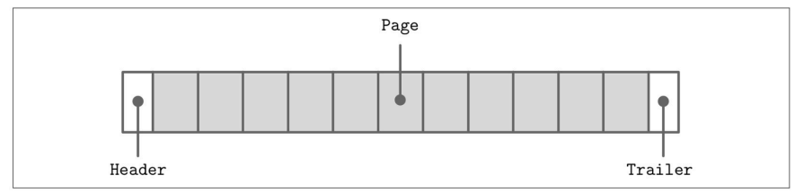
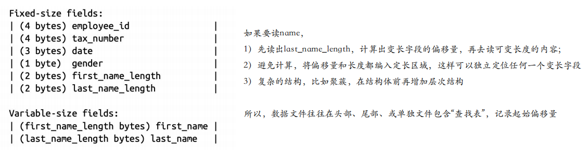
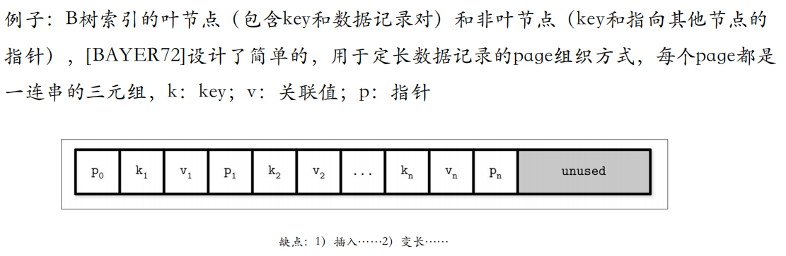
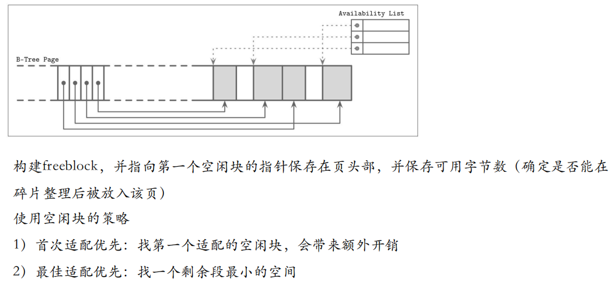

## 组成原理 Review

### 大端序和小端序

## 物理组织形式通用原理

### 文件格式

通常，设计文件格式，第⼀步是确定**寻址方式**

- 文件拆成相同大小的页（page），单个块（block）或者连续块（multiple block）组成

- 相同大小的page，目的是简化读取和写入访问，按页写入，从内存写到磁盘

  

表头-若干page-表尾

> - 数据存储结构一般分成两类——原地更新*（省空间）*、仅追加*（操作简单、可以实现多版本）*，通常都是按照页进行组织。
>
> - 目前更多的是**原地更新**。

### 数据库表结构

- 数据库的表结构（schema）⼀般是固定的，指定了字段的数量、顺序和类型
  - 固定的好处是减少存储数量，使用位置标识符，而不需要记录加上字段名
  - 例子：员工表（姓名、生日、税号、性别……）

### 页的结构

- Page的大小一般是4-16K
- 

#### 变长：分槽页

最小开销：唯一额外开销是指针数组

解决$N$个key $N+1$个value的问题：

- 添加最后一个value下的最大值作为key
- 在页头单独存放最右指针，其它键值+指针匹配存放

#### 变长数据的空闲块管理

- 在页头维护一个`Availability List`空闲区列表管理空白块

  

  具体选择哪个策略，需要衡量瓶颈在<u>时间</u>还是<u>空间</u>

- Freeblock，空间冗余应对变长数据 70%/30%原则 *空间换时间*

#### 页头的结构（Header）

页头登记了关于页面内容的元数据，如页面大小、校验和、DBMS版本、事务可见性、压缩信息等。有些系统（如Oracle）要求页面是自包含的，即关于该页的所有描述信息都可以在该页面中找到。

### 溢出页

- 节点大小和树扇出是固定且不会动态改变的
- 我们页很难找到一个普遍最优的值
  - 树中存在变长值，并且它们足够大，那么页中放下少数几个值
  - 如果值很小，会浪费保留的空间
- B树算法规定每个节点持有特定数量的元素，所以不得不面对一种方法增加或者拓展页大小

> 放不下的指向一个**溢出页**

### B树节点分裂和合并

- B+树分裂和合并都是从叶节点发起的，向上传递的
  - 读的时候使用栈记录来时的路径
  - 在page头保存一个向上的指针

#### 再平衡

问题：删除和插入操作会导致B树节点分裂合并的频繁操作

解决：再平衡——出现插入之前，发现节点与节点之间数量差距大，分一部分数给少的那个节点。

- 提高平均占用率
- 但需要额外的跟踪和平衡
- 更高的利用率以为者更高效的搜索

#### 右侧追加

- 自增数值作为主索引的优势在优化方面
  - 所有插入都在索引的末尾（最右侧的叶子）
  - 可以直接分配新节点
- 大量数据加载，可以重新构建B+树
  - 先随机插入，暂时把索引关了，然后自下而上重新构建索引

### 压缩

访问速度和压缩率，时间空间平衡

不同粒度下的压缩

- 文件压缩
- 按页压缩数据
- 按记录行/列压缩

### 维护

更新和删除碎片

## 数据物理组织

数据库技术冲突的目标

数据密集利于读，数据分散利于写

文件物理组织形式：

> 数据库的具体文件的物理组织形式本质都是**树**

- 顺序文件（索引、B+树）
- 散列文件（hash）
- 随机文件（堆文件）
- 聚簇文件（融合性文件）*根据业务逻辑，修改物理排布，例如JOIN两个表*

## 分区

### 数据自动分组

- 分区（partition）也是数据分组的方式

  - 提高并发性和并行性
  - 从而增强系统架构的可伸缩性

- 面对两大问题

  - 管理问题（备份和恢复）d

    > 例子：备份10个T的大数据，需要30分钟，这时小伙伴踢掉了电线d，由于数据库的事务性，数据库需要花十几分钟Roll back，再重新传。。😭
    >
    > 分而治之就好了 **分区**

  - 数据量巨大的表，B+树索引失效，非聚簇索引的大量随机I/O问题。

### 循环分区

循环分区：不受数据影响的内部机制

- 分区定义为各个磁盘的存储区域
- 可以看错随意散布数据的机制
- 保持更改带来的磁盘I/O的平衡

### 数据驱动分区

- 根据一个或多个字段中的值来定义分区

  - 一半叫分区试图，而MYSQL老版本称为`merge table`

  > partition-key 确定数据放在哪个分区

- 分区的实现方式
  - 哈希分区
  - 范围分区（*常见：时间*）/ 键值分区（*根据类型*）
  - 列表分区 *不太常见，把字段拆开*

### 分区表的底层实现原理

- 分区表是由多个相关的底层表实现的
- 存储引擎视角，分区表和普通的表没有区别
- **锁住所有底层表**（一瞬间），执行操作

### 分区是一把双刃剑

- NULL值会使分区过滤无效（空值过多导致某个分区过大）
- 分区列和索引列不匹配
- 选择分区的成本可能很高
- 打开并锁住所有底层表的成本可能很高
- 维护分区的成本可能很高

~~一个看上去很帅的东西，一定有非常讨厌的地方（技术和人都是如此）~~

大数据量和高并发下：

- 如果SQL不走分区键，很容易造成全表锁，或者多次调用相同索引
- 分区中实现关联查询就是一个灾难
- 分区表，隐藏复杂，使得工程师不可控

Maybe你可以手搓分区（分表）

### 数据分区的最佳方法

- 整体改善业务处理的操作，才是选择非缺省的存储选项的目标
- 更新分区键会引起移动数据，似乎应该避免这么做

## 分库分表

### 分表

分表就是手搓分区

> 分区在逻辑上仍是一张表

- 把一张表按一定的规则分解成N个具有独立存储空间的实体表
- 系统读写时需要根据定义好的规则得到对应的子表名，然后操作它

优点：

- 单表并发能力提高，磁盘I/O性能提高（数据分布在不同文件），写操作效率提高
- **读写锁**影响的数据变小
- 插入数据库需要**建立索引**的数据减少

访问量不大，数据较多时可以只考虑分区不分表

### 遇到瓶颈的解决方案

IO瓶颈

- 热点数据太多，数据缓存不够，每次查询产生大量IO ——分库、垂直分表
- 网络IO瓶颈，请求的数据太多，带宽不够、连接数过多 ——分库

CPU瓶颈

- SQL问题，join、group by、order by ——SQL优化，构建索引
- 单表数据量过大、扫描行太多，SQL效率过低 ——水平分表

### 分库

分库的方法：

1. 垂直拆分
2. 水平拆分
3. 读写分离

可能需要数据库中间件

### 全局ID生成

- 自动增长列 分库分表需要手动规划
- UUID 
- 。。。