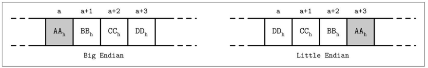
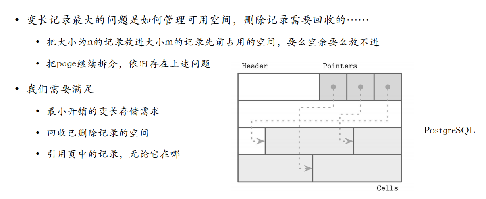

### 组成原理 Review

### 大端序和小端序

## 物理组织形式通用原理

### 文件格式

通常，设计文件格式，第⼀步是确定**寻址方式**

- 文件拆成相同大小的页（page），单个块（block）或者连续块（multiple block）组成

- 相同大小的page，目的是简化读取和写入访问，按页写入，从内存写到磁盘

  

表头-若干page-表尾

> - 数据存储结构一般分成两类——原地更新*（省空间）*、仅追加*（操作简单、可以实现多版本）*，通常都是按照页进行组织。
>
> - 目前更多的是**原地更新**。

### 数据库表结构

- 数据库的表结构（schema）⼀般是固定的，指定了字段的数量、顺序和类型
  - 固定的好处是减少存储数量，使用位置标识符，而不需要记录加上字段名
  - 例子：员工表（姓名、生日、税号、性别……）

### 页的结构

- Page的大小一般是4-16K
- 

#### 变长：分槽页

最小开销：唯一额外开销是指针数组

解决$N$个key $N+1$个value的问题：

- 添加最后一个value下的最大值作为key
- 在页头单独存放最右指针，其它键值+指针匹配存放

#### 变长数据的空闲块管理

- 在页头维护一个`Availability List`空闲区列表管理空白块

  

  具体选择哪个策略，需要衡量瓶颈在<u>时间</u>还是<u>空间</u>

- Freeblock，空间冗余应对变长数据 70%/30%原则 *空间换时间*

#### 页头的结构（Header）

页头登记了关于页面内容的元数据，如页面大小、校验和、DBMS版本、事务可见性、压缩信息等。有些系统（如Oracle）要求页面是自包含的，即关于该页的所有描述信息都可以在该页面中找到。

### 溢出页

- 节点大小和树扇出是固定且不会动态改变的
- 我们页很难找到一个普遍最优的值
  - 树中存在变长值，并且它们足够大，那么页中放下少数几个值
  - 如果值很小，会浪费保留的空间
- B树算法规定每个节点持有特定数量的元素，所以不得不面对一种方法增加或者拓展页大小

> 放不下的指向一个**溢出页**

### B树节点分裂和合并

- B+树分裂和合并都是从叶节点发起的，向上传递的
  - 读的时候使用栈记录来时的路径
  - 在page头保存一个向上的指针

#### 再平衡

问题：删除和插入操作会导致B树节点分裂合并的频繁操作

解决：再平衡——出现插入之前，发现节点与节点之间数量差距大，分一部分数给少的那个节点。

- 提高平均占用率
- 但需要额外的跟踪和平衡
- 更高的利用率以为者更高效的搜索

#### 右侧追加

- 自增数值作为主索引的优势在优化方面
  - 所有插入都在索引的末尾（最右侧的叶子）
  - 可以直接分配新节点
- 大量数据加载，可以重新构建B+树
  - 先随机插入，暂时把索引关了，然后自下而上重新构建索引