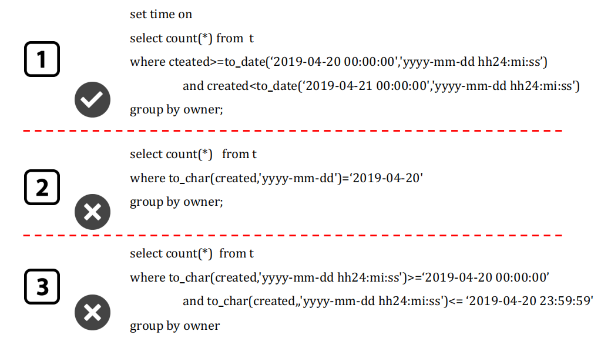
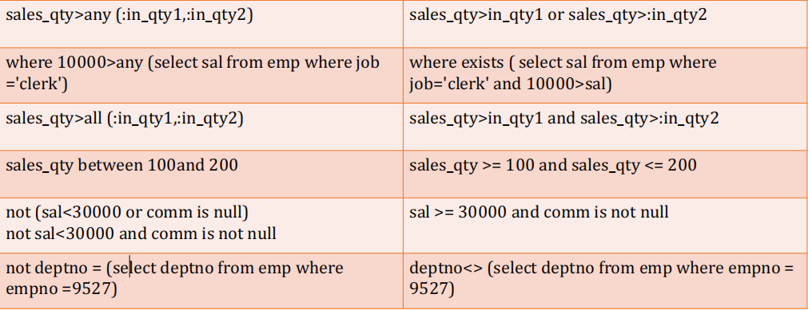
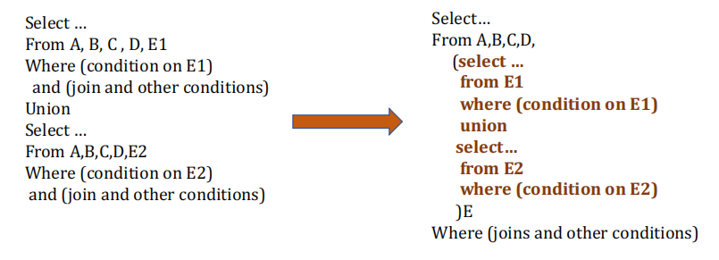
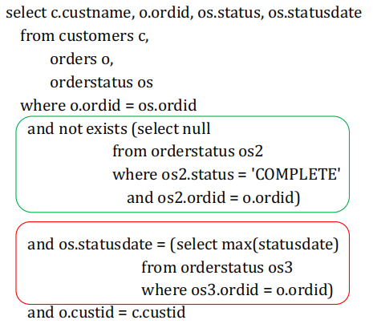
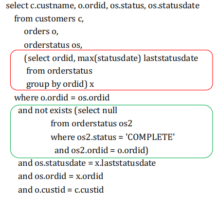
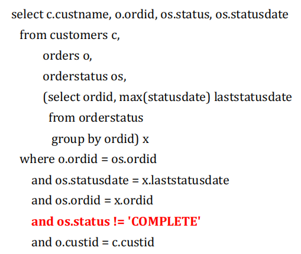

## SQL和查询优化器

优化器借助关系理论提供的语义无误的原始查询进行**有效的等价变换**，实现将一个SQL查询优化成为更高效的方案。

- RBO基于规则的优化器
- CBO基于成本的优化器

## SQL解析

软解析和硬解析

绑定变量：

```sql
select 
from
1. where x = 5 | x = 3 # 这里要生成两个查询计划
2. where x = a # 绑定变量，只生成一个
```

## SQL优化器

**常见的SQL表达式优化：**

- 移除不必要的括号

- 常量传递

- 移除没用的条件

- 表达式计算

  - `a - 1 = 6`不会被优化成`a = 7`，因为优化器无法判断`a - 1`是否可以对应到一个**函数索引**。

- `having`和`where`子句合并（没有`sum`，` max`这样的聚合函数和`group by `子句）

- 常量表检查

> 优化器不会对**表达式左侧**进行优化

## SQL书写

查询在Nanjing市，在最近六个月买了BMW的人

> 考虑可能有重名，考虑可能有一个人买了多次。

避免在最高层`distinct`应该是一条基本规则 => 使用嵌套查询

存在性测试子查询一般不会被执行结束

关联嵌套查询——关联条件的字段上应该要有索引

Any/All 标量子查询 ->单独执行

## SQL优化

### 日期函数的比较



> 只有第一种效率高，因为只有第一种方式表达式左侧**没有函数**，可以**利用索引信息**。

### 比较函数的转化

这些都是查询优化器自动转化的：



> `Any`和`All`看起来很像是个废物啊😋

### 大数据量连接

**核心思想：**越快剔除不需要的数据



### 将聚合子查询转换为JOIN或内嵌视图

在订单完成前有不同状态，记录在`orderstatus（ordid,status,statusdate）`中

需求是：列出**所有尚未标记为完成状态**的订单的下列字段：订单号，客户名，订单的最后状态，以及设置状态的时间。



将非关联子查询变成内嵌视图：



